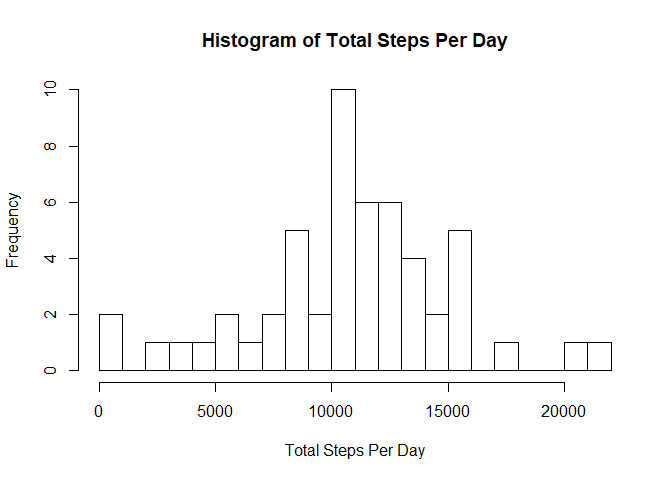

## Loading and preprocessing the data


```r
activityDF <- read.csv("C:/Users/HP/Documents/Coursera/RepData_PeerAssessment1/activity/activity.csv", stringsAsFactor = FALSE)
str(activityDF)
```

```
## 'data.frame':	17568 obs. of  3 variables:
##  $ steps   : int  NA NA NA NA NA NA NA NA NA NA ...
##  $ date    : chr  "2012-10-01" "2012-10-01" "2012-10-01" "2012-10-01" ...
##  $ interval: int  0 5 10 15 20 25 30 35 40 45 ...
```

```r
activityDF$date <- as.Date(activityDF$date)
```

## What is mean total number of steps taken per day?

The total number of steps taken per day


```r
TotalStepsPerDay <- tapply(activityDF$steps, as.factor(activityDF$date), sum)
```


Histogram of total number of steps taken each day


```r
hist(TotalStepsPerDay, xlim = c(0,22000), ylim = c(0,10), breaks = 20, xlab = "Total Steps Per Day", main = "Histogram of Total Steps Per Day")
```

<!-- -->


Mean of the total number of steps taken per day


```r
mean(TotalStepsPerDay, na.rm = TRUE)
```

```
## [1] 10766.19
```


Median of the total number of steps taken per day


```r
median(TotalStepsPerDay, na.rm = TRUE)
```

```
## [1] 10765
```


## What is the average daily activity pattern?

Calculating the average steps taken per interval across all days


```r
averageStepsPerInterval <- tapply(activityDF$steps, activityDF$interval, mean, na.rm = TRUE)
```


Converting the array into a data frame


```r
averageStepsPerInterval <- as.data.frame.table(averageStepsPerInterval)
colnames(averageStepsPerInterval) <- c("Interval", "AverageSteps")
head(averageStepsPerInterval)
```

```
##   Interval AverageSteps
## 1        0    1.7169811
## 2        5    0.3396226
## 3       10    0.1320755
## 4       15    0.1509434
## 5       20    0.0754717
## 6       25    2.0943396
```


Time-series plot of the 5-minute interval and average number of steps taken, averaged across all days


```r
plot(averageStepsPerInterval$Interval, averageStepsPerInterval$AverageSteps, type = "l")
```

<!-- -->


Calculating the 5-minute interval which contains the maximum number of steps, averaged across all days


```r
averageStepsPerInterval[which.max(averageStepsPerInterval$AverageSteps),]
```

```
##     Interval AverageSteps
## 104      835     206.1698
```


```r
maxInterval <- averageStepsPerInterval[104, 1]
maxSteps <- averageStepsPerInterval[104,2]
```

The 5-minute interval 835 contains the maximum number of steps, 206.1698113, on average across all days


## Imputing missing values


Calculating the total number of rows with NAs


```r
TotalNA <- sum(!complete.cases(activityDF))
TotalNA 
```

```
## [1] 2304
```

The total number of rows with NAs is 2304 


Creating a new dataset that is equal to the original dataset but with the missing values in 'steps' filled in with the means of the steps for the associated 5-minute intervals across all days


```r
newactivityDF <- activityDF

for (i in 1:nrow(newactivityDF)) {
   if (is.na(newactivityDF[i, 1])) {
      newactivityDF[i,1] <- averageStepsPerInterval$AverageSteps[averageStepsPerInterval$Interval == newactivityDF[i,3]]
      }
}

head(newactivityDF)
```

```
##       steps       date interval
## 1 1.7169811 2012-10-01        0
## 2 0.3396226 2012-10-01        5
## 3 0.1320755 2012-10-01       10
## 4 0.1509434 2012-10-01       15
## 5 0.0754717 2012-10-01       20
## 6 2.0943396 2012-10-01       25
```

The total number of steps taken per day


```r
NewTotalStepsPerDay <- tapply(newactivityDF$steps, as.factor(newactivityDF$date), sum)
```


Histogram of total number of steps taken each day


```r
hist(NewTotalStepsPerDay, xlim = c(0,22000), ylim = c(0,20), breaks = 20, xlab = "Total Steps Per Day", main = "Histogram of Total Steps Per Day")
```

<!-- -->


Mean of the total number of steps taken per day


```r
mean(NewTotalStepsPerDay)
```

```
## [1] 10766.19
```


Median of the total number of steps taken per day


```r
median(NewTotalStepsPerDay)
```

```
## [1] 10766.19
```


Imputing missing values with the means of the steps for 5-minute intervals hasn't had any effect on the mean and median values of the total steps per day. While the mean is identical, the median has not changed significantly.


## Are there differences in activity patterns between weekdays and weekends?


Creating a new factor variable in the dataset with two levels - "weekday" and "weekend"


```r
newactivityDF$Day <- ifelse(weekdays(newactivityDF$date) == "Saturday" | weekdays(newactivityDF$date) == "Sunday", "weekend", "weekday")
newactivityDF$Day <- as.factor(newactivityDF$Day)
```

Calculating the average number of steps for each 5-minute interval across all days grouped by weekends and weekdays


```r
newaverageStepsPerDay <- tapply(newactivityDF$steps, list(newactivityDF$interval, newactivityDF$Day), mean)
```

Converting newaverageStepsPerDay to a data frame


```r
newaverageStepsPerDay <- as.data.frame.table(newaverageStepsPerDay)
str(newaverageStepsPerDay)
```

```
## 'data.frame':	576 obs. of  3 variables:
##  $ Var1: Factor w/ 288 levels "0","5","10","15",..: 1 2 3 4 5 6 7 8 9 10 ...
##  $ Var2: Factor w/ 2 levels "weekday","weekend": 1 1 1 1 1 1 1 1 1 1 ...
##  $ Freq: num  2.251 0.445 0.173 0.198 0.099 ...
```


Time series plot of the 5-minute interval and the average number of steps taken averaged across all weekdays or weekend days


```r
newaverageStepsPerDay$Var1 <- as.integer(levels(newaverageStepsPerDay$Var1))[newaverageStepsPerDay$Var1]
library(lattice)
xyplot(Freq~Var1|Var2, newaverageStepsPerDay, type = "l", layout = c(1,2), xlab = "interval", ylab = "Number of steps", xlim = c(0,2500))
```

<!-- -->

